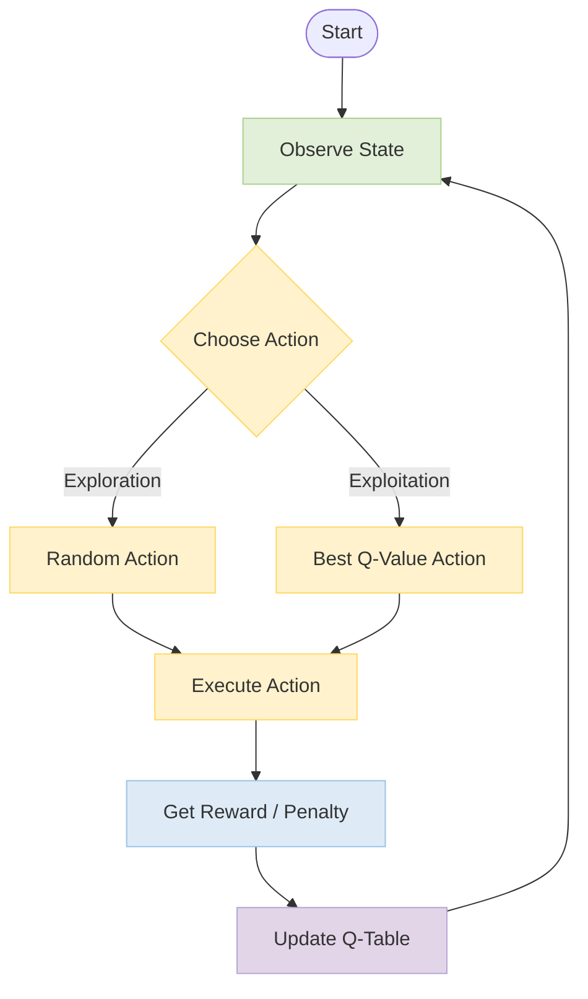

# SnakeEater AI

A comprehensive update to the classic Snake game, featuring a reinforcement learning-based AI agent. This project demonstrates the integration of modern game development practices with machine learning using Python and Pygame.

## Project Overview

SnakeEater AI features a battle royale environment. The project showcases:
*   **Machine Learning**: An intelligent agent trained using Q-Learning to survive and compete.
*   **Game Development**: A robust game engine built on Pygame with optimized rendering and collision detection.
*   **UI/UX**: Modern user interface with dynamic text, scoreboards, and smooth visual effects.

## Machine Learning Model (Q-Learning)

The AI agent uses **Q-Learning**, a reinforcement learning algorithm, to make decisions. The process follows this cycle:



## Features

*   **Intelligent Adversaries**: Computer snakes trained to hunt food and avoid collisions.
*   **Spectator Mode**: Watch the AI learn and evolve in real-time (`learn.py`).
*   **Visual Polish**: Custom textures for snakes and backgrounds, particle effects, and polished UI elements.
*   **Audio Integration**: Background music and sound effects for immersive gameplay.
*   **Optimization**: Implemented **Spatial Grid** system (`spatial.py`) for efficient collision detection, enabling high-performance training.

## Architecture

The project is organized into a modular structure to ensure maintainability and scalability:

*   **`src/`**: Core source code.
    *   **`game.py`**: Main game loop, rendering logic, and state management.
    *   **`snake.py`**: Snake entity logic, including movement and AI behavior.
    *   **`spatial.py`**: Spatial grid implementation for optimized collision detection (O(N) performance).
    *   **`mlAgent/`**: Q-Learning implementation (`qAgent.py`, `config.py`).
*   **`scripts/`**: Utility scripts for building executables and generating assets.
*   **`assets/`**: Game resources including images and audio files.
*   **`main.py`**: Entry point for the standard game mode (Human vs AI).
*   **`learn.py`**: Entry point for the training/spectator mode (AI vs AI).

## Class Structure

<table width="100%">
  <tr>
    <th width="25%">Core System</th>
    <th width="30%">Entities</th>
    <th width="20%">Items</th>
    <th width="25%">Artificial Intelligence</th>
  </tr>
  <tr>
    <!-- Core -->
    <td valign="top">
      <h3>GAME</h3>
      <ul>
        <li><b>Properties</b>
            <ul>
                <li><code>mode</code>: str</li>
                <li><code>snakes</code>: List</li>
                <li><code>food</code>: List</li>
                <li><code>agent</code>: QLearningAgent</li>
            </ul>
        </li>
        <li><b>Methods</b>
            <ul>
                <li><code>setUp()</code></li>
                <li><code>update()</code></li>
                <li><code>draw()</code></li>
                <li><code>checkCollision()</code></li>
            </ul>
        </li>
      </ul>
    </td>
    <!-- Entities -->
    <td valign="top">
      <h3>Snake</h3>
      <sub>Base Class</sub>
      <ul>
        <li><code>body</code>: List[Rect]</li>
        <li><code>length</code>: int</li>
        <li><code>score</code>: int</li>
        <li><code>direction</code>: Vector2</li>
        <li><code>move()</code></li>
        <li><code>draw()</code></li>
      </ul>
      <hr>
      <h3>PlayerSnake</h3>
      <sub>Inherits Snake</sub>
      <ul>
        <li><code>updateDirectionByMouse()</code></li>
      </ul>
      <hr>
      <h3>ComputerSnake</h3>
      <sub>Inherits Snake</sub>
      <ul>
        <li><code>angle</code>: float</li>
        <li><code>stateOld</code>: tuple</li>
        <li><code>performAction(action)</code></li>
      </ul>
    </td>
    <!-- Items -->
    <td valign="top">
      <h3>Food</h3>
      <ul>
        <li><b>Properties</b>
            <ul>
                <li><code>x, y</code>: int</li>
                <li><code>type</code>: str</li>
                <li><code>growthValue</code>: int</li>
            </ul>
        </li>
        <li><b>Subclasses</b>
            <ul>
                <li><code>SmallFood</code></li>
                <li><code>MediumFood</code></li>
                <li><code>LargeFood</code></li>
            </ul>
        </li>
      </ul>
    </td>
    <!-- AI -->
    <td valign="top">
      <h3>QLearningAgent</h3>
      <ul>
        <li><b>Properties</b>
            <ul>
                <li><code>qTable</code>: dict</li>
                <li><code>epsilon</code>: float</li>
                <li><code>lr</code>: float</li>
            </ul>
        </li>
        <li><b>Methods</b>
            <ul>
                <li><code>getQValue()</code></li>
                <li><code>chooseAction()</code></li>
                <li><code>learn()</code></li>
            </ul>
        </li>
      </ul>
    </td>
  </tr>
</table>

## Installation

1.  Clone the repository:
    ```bash
    git clone https://github.com/Nelson0314/aoop_2025_group11_snakeEater.git
    cd aoop_2025_group11_snakeEater
    ```

2.  Install dependencies:
    ```bash
    pip install -r requirements.txt
    ```

## Usage

### Play Mode
To play the game against AI opponents:
```bash
python main.py
```
*   **Controls**: 
    *   **Mouse Move**: Steer your snake.
    *   **Mouse Left Click (Hold)**: Boost speed (Consumes score/length).
*   **Goal**: Eat food to grow, avoid walls and other snakes. Cut off opponents to kill them.


### Spectator / Training Mode
To watch the AI training process:
```bash
python learn.py
```
*   **Controls**:
    *   `A` / `D`: Switch between different AI snakes to spectate.
    *   `G`: Toggle "God View" to see the entire map.


## Credits

**Group 11**
*   Nelson0314

Developed for AOOP 2025.