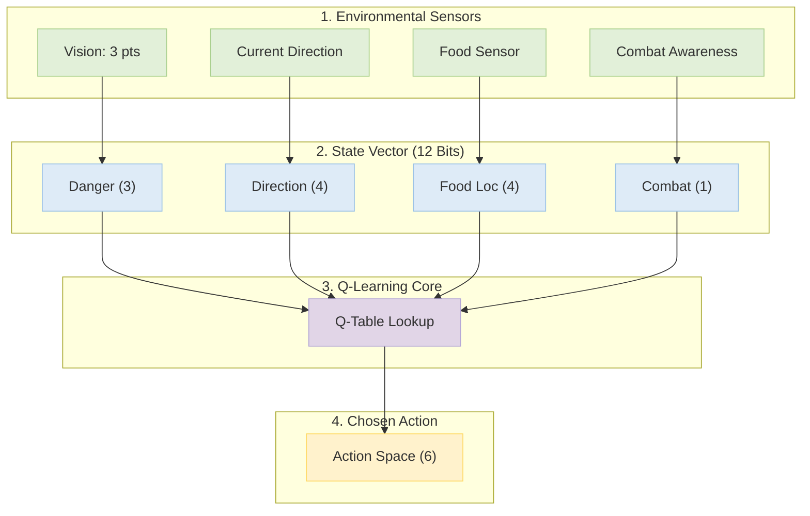
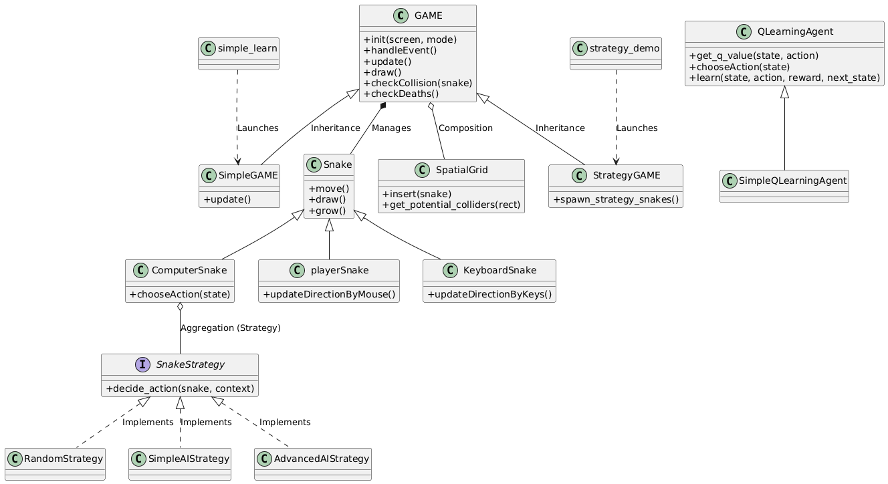

# SnakeEater AI

A comprehensive update to the classic Snake game, featuring a reinforcement learning-based AI agent. This project demonstrates the integration of modern game development practices with machine learning using Python and Pygame.

## Project Overview

SnakeEater AI features a battle royale environment. The project showcases:
*   **Machine Learning**: An intelligent agent trained using Q-Learning to survive and compete.
*   **Game Development**: A robust game engine built on Pygame with optimized rendering and collision detection.
*   **UI/UX**: Modern user interface with dynamic text, scoreboards, and smooth visual effects.

## Machine Learning Model (Q-Learning)

The AI agent uses **Q-Learning**, a reinforcement learning algorithm, to make decisions. The process follows this cycle:


### State Representation

The agent perceives the environment through a **12-bit state vector** tuple:

| Index | Feature | Description |
| :---: | :--- | :--- |
| **0** | **Danger Forward** | Collision risk ahead within vision range. |
| **1** | **Danger Right** | Collision risk to the relative right. |
| **2** | **Danger Left** | Collision risk to the relative left. |
| **3** | **Direction Left** | Moving West currently. |
| **4** | **Direction Right** | Moving East currently. |
| **5** | **Direction Up** | Moving North currently. |
| **6** | **Direction Down** | Moving South currently. |
| **7** | **Food Left** | Closest food is to the West. |
| **8** | **Food Right** | Closest food is to the East. |
| **9** | **Food Up** | Closest food is to the North. |
| **10** | **Food Down** | Closest food is to the South. |
| **11** | **Combat Aware** | Enemy head detected near strategic body segments (Cut-off risk). |

### Action Space

The agent chooses from **6 discrete actions** at each step:

| ID | Action | Effect |
| :---: | :--- | :--- |
| **0** | **Straight** | Maintain current direction. |
| **1** | **Turn Left** | Rotate angle counter-clockwise. |
| **2** | **Turn Right** | Rotate angle clockwise. |
| **3** | **Boost Straight** | Accelerate forward (Consumes score). |
| **4** | **Boost Left** | Accelerate and turn left. |
| **5** | **Boost Right** | Accelerate and turn right. |



## Features

*   **Intelligent Adversaries**: Computer snakes trained to hunt food and avoid collisions.
*   **Spectator Mode**: Watch the AI learn and evolve in real-time (`learn.py`).
*   **Visual Polish**: Custom textures for snakes and backgrounds, particle effects, and polished UI elements.
*   **Audio Integration**: Background music and sound effects for immersive gameplay.
*   **Optimization**: Implemented **Spatial Grid** system (`spatial.py`) for efficient collision detection, enabling high-performance training.

## Architecture

The project is organized into a modular structure to ensure maintainability and scalability:

*   **`src/`**: Core source code.
    *   **`game.py`**: Main game loop, rendering logic, and state management.
    *   **`snake.py`**: Snake entity logic, including movement and AI behavior.
    *   **`spatial.py`**: Spatial grid implementation for optimized collision detection (O(N) performance).
    *   **`mlAgent/`**: Q-Learning implementation (`qAgent.py`, `config.py`).
*   **`scripts/`**: Utility scripts for building executables and generating assets.
*   **`assets/`**: Game resources including images and audio files.
*   **`main.py`**: Entry point for the standard game mode (Human vs AI).
*   **`learn.py`**: Entry point for the training/spectator mode (AI vs AI).

## Class Structure

<div align="center">
  
</div>

## Installation

1.  Clone the repository:
    ```bash
    git clone https://github.com/Nelson0314/aoop_2025_group11_snakeEater.git
    cd aoop_2025_group11_snakeEater
    ```

2.  Install dependencies:
    ```bash
    pip install -r requirements.txt
    ```

## Usage

### Play Mode
To play the game against AI opponents:
```bash
python main.py
```
*   **Controls**: 
    *   **Mouse Move**: Steer your snake.
    *   **Mouse Left Click (Hold)**: Boost speed (Consumes score/length).
*   **Goal**: Eat food to grow, avoid walls and other snakes. Cut off opponents to kill them.


### Spectator / Training Mode
To watch the AI training process:
```bash
python learn.py
```
*   **Controls**:
    *   `A` / `D`: Switch between different AI snakes to spectate.
    *   `G`: Toggle "God View" to see the entire map.


### Simple Learning Demo (4-State)
A simplified version of the AI for educational demonstration, using a 4-bit state vector.

*   **Purpose**: Demonstrates the core Q-Learning concept with minimal complexity (Danger Front, Food Direction).
*   **Visuals**: Includes full game rendering and camera controls (`G`, `A`, `D`).

### Strategy Pattern Demo
Demonstrates the separation of "Brain" (Strategy) from "Body" (Snake) using Object-Oriented Design.

*   **Red Snake**: Random Strategy (Dumb).
*   **Blue Snake**: Simple AI Strategy (4-State Learning).
*   **Green Snake**: Advanced AI Strategy (12-State Learning).


## Credits

**Group 11**
*   Nelson0314

Developed for AOOP 2025.