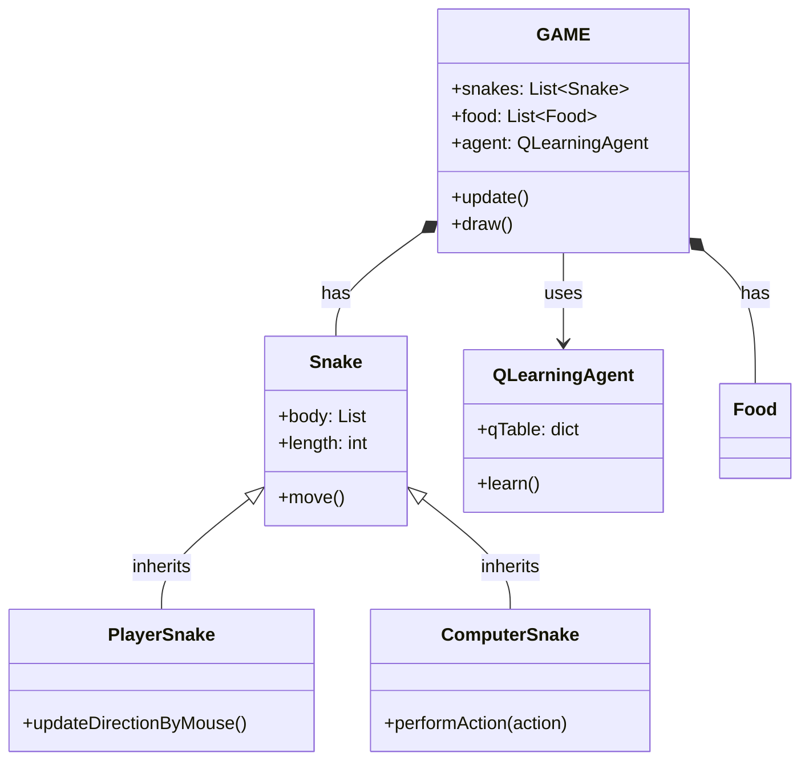

# SnakeEater AI

A comprehensive update to the classic Snake game, featuring a reinforcement learning-based AI agent. This project demonstrates the integration of modern game development practices with machine learning using Python and Pygame.

## Project Overview

SnakeEater AI features a battle royale environment. The project showcases:
*   **Machine Learning**: An intelligent agent trained using Q-Learning to survive and compete.
*   **Game Development**: A robust game engine built on Pygame with optimized rendering and collision detection.
*   **UI/UX**: Modern user interface with dynamic text, scoreboards, and smooth visual effects.

## Features

*   **Intelligent Adversaries**: Computer snakes trained to hunt food and avoid collisions.
*   **Spectator Mode**: Watch the AI learn and evolve in real-time (`learn.py`).
*   **Visual Polish**: Custom textures for snakes and backgrounds, particle effects, and polished UI elements.
*   **Audio Integration**: Background music and sound effects for immersive gameplay.

## Architecture

The project is organized into a modular structure to ensure maintainability and scalability:

*   **`src/`**: Core source code.
    *   **`game.py`**: Main game loop, rendering logic, and state management.
    *   **`snake.py`**: Snake entity logic, including movement and AI behavior.
    *   **`mlAgent/`**: Q-Learning implementation (`qAgent.py`, `config.py`).
*   **`scripts/`**: Utility scripts for building executables and generating assets.
*   **`assets/`**: Game resources including images and audio files.
*   **`main.py`**: Entry point for the standard game mode (Human vs AI).
*   **`learn.py`**: Entry point for the training/spectator mode (AI vs AI).

## Class Structure



## Installation

1.  Clone the repository:
    ```bash
    git clone https://github.com/Nelson0314/aoop_2025_group11_snakeEater.git
    cd aoop_2025_group11_snakeEater
    ```

2.  Install dependencies:
    ```bash
    pip install -r requirements.txt
    ```

## Usage

### Play Mode
To play the game against AI opponents:
```bash
python main.py
```
*   **Controls**: Mouse to steer your snake.
*   **Goal**: Eat food to grow, avoid walls and other snakes. Cut off opponents to kill them.

### Spectator / Training Mode
To watch the AI training process:
```bash
python learn.py
```
*   **Controls**:
    *   `A` / `D`: Switch between different AI snakes to spectate.
    *   `G`: Toggle "God View" to see the entire map.

## Credits

**Group 11**
*   Nelson0314

Developed for AOOP 2025.