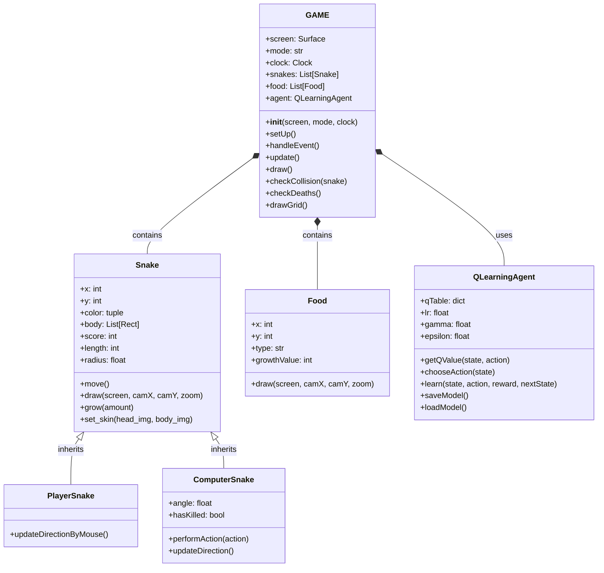

# System Architecture

## Class Diagram

```mermaid
classDiagram
    class GAME {
        +screen: Surface
        +mode: str
        +clock: Clock
        +snakes: List[Snake]
        +food: List[Food]
        +agent: QLearningAgent
        +__init__(screen, mode, clock)
        +setUp()
        +handleEvent()
        +update()
        +draw()
        +checkCollision(snake)
        +checkDeaths()
        +drawGrid()
    }

    class Snake {
        +x: int
        +y: int
        +color: tuple
        +body: List[Rect]
        +score: int
        +length: int
        +radius: float
        +move()
        +draw(screen, camX, camY, zoom)
        +grow(amount)
        +set_skin(head_img, body_img)
    }

    class PlayerSnake {
        +updateDirectionByMouse()
    }

    class ComputerSnake {
        +angle: float
        +hasKilled: bool
        +performAction(action)
        +updateDirection()
    }

    class Food {
        +x: int
        +y: int
        +type: str
        +growthValue: int
        +draw(screen, camX, camY, zoom)
    }

    class QLearningAgent {
        +qTable: dict
        +lr: float
        +gamma: float
        +epsilon: float
        +getQValue(state, action)
        +chooseAction(state)
        +learn(state, action, reward, nextState)
        +saveModel()
        +loadModel()
    }

    GAME *-- Snake : contains
    GAME *-- Food : contains
    GAME *-- QLearningAgent : uses
    Snake <|-- PlayerSnake : inherits
    Snake <|-- ComputerSnake : inherits
```
