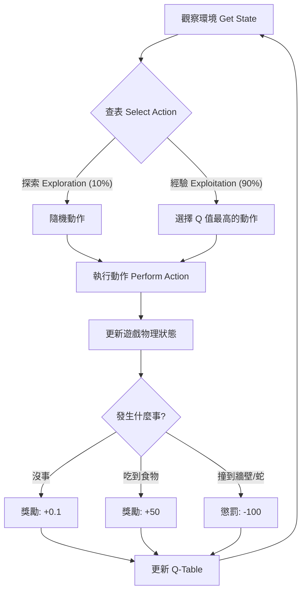

# Machine Learning Architecture & Flow

這個文檔說明了目前的 **Q-Learning** 架構，包含訓練流程圖以及狀態機 (State Machine) 的定義。

## 1. 訓練流程 (Training Loop)

每一隻 AI 蛇在每一幀 (Frame) 都會經歷以下循環：

## 2. 狀態機定義 (Finite State Definition)

我們將連續的遊戲畫面簡化為有限的 **11 個 bit**，組合成一個 Tuple 作為 State ID。
這意味著總共有 $2^{11} = 2048$ 種可能的狀態 (實際上會更少，因為方向互斥)。

### 狀態組成 (11 bits)

| 類別 | 特徵 | 說明 |
| :--- | :--- | :--- |
| **危險偵測 (Danger)**   (3 bits) | `danger_straight` | 前方 3 格內有障礙物 (牆壁或別人身體) |
| | `danger_right` | 右前方 3 格內有障礙物 |
| | `danger_left` | 左前方 3 格內有障礙物 |
| **目前方向 (Moving)**   (4 bits) | `dir_left` | 目前是否向左移動 (Velocity X < 0) |
| | `dir_right` | 目前是否向右移動 (Velocity X > 0) |
| | `dir_up` | 目前是否向上移動 (Velocity Y < 0) |
| | `dir_down` | 目前是否向下移動 (Velocity Y > 0) |
| **食物方位 (Food)**   (4 bits) | `food_left` | 最近的食物在左邊 |
| | `food_right` | 最近的食物在右邊 |
| | `food_up` | 最近的食物在上方 |
| | `food_down` | 最近的食物在下方 |

### 狀態範例
例如，狀態 `(1, 0, 0,  0, 1, 0, 0,  1, 0, 0, 1)` 代表：
*   **[Danger]**: 前方有危險 `(1, 0, 0)`
*   **[Moving]**: 正在往右移動 `(0, 1, 0, 0)`
*   **[Food]**: 食物在左下方 `(1, 0, 0, 1)`

## 3. 動作空間 (Action Space)

AI 只能選擇以下三種動作之一：

| Action ID | 動作 | 說明 |
| :---: | :--- | :--- |
| **0** | **直走** (Straight) | 保持目前方向不變 |
| **1** | **左轉** (Left) | 向左轉 `config.TURN_ANGLE` 度 (預設 15 度) |
| **2** | **右轉** (Right) | 向右轉 `config.TURN_ANGLE` 度 (預設 15 度) |

## 4. 學習公式 (Q-Learning Update)

當 AI 執行動作 $A$ 在狀態 $S$，得到獎勵 $R$，並進入新狀態 $S'$ 時，我們這樣更新它的腦袋：

$$Q(S, A) \leftarrow Q(S, A) + \alpha [R + \gamma \max Q(S', a) - Q(S, A)]$$

*   $\alpha$ (`LEARNING_RATE`): 學習率 (目前設 0.1)
*   $\gamma$ (`DISCOUNT_FACTOR`): 遠見程度 (目前設 0.9)
